<h1 id="top" align="center">
  
  Aesthetic cursor
</h1>

<br />


<pre align="center">
  <a href="#installation">📦 SETUP</a>
</pre>




<br />

<div align="center">
  &nbsp;&nbsp;&nbsp;
  &nbsp;&nbsp;&nbsp;
  &nbsp;&nbsp;&nbsp;
  &nbsp;&nbsp;&nbsp;
</div>


<h2 id="about">
  
  About
</h2>

<table border="0">
<tr>
<td>
A minimal, clean, and modern cursor theme designed to bring a touch of elegance and style to your Linux desktop. ✨🖱️
</td>
</tr>
</table>

<br />


<h2 id="table-of-content">
  
  Table of content
</h2>

- [ About](#about)
- [ Requirements](#requirements)
- [ Installation](#installation)
- [ Usage](#usage)

<br />


<h2 id="requirements">
  
  Requirements
</h2>

-  pacman >= **7.1.0**

<br />


<h2 id="installation">
  
  Installation
</h2>

<h3> Pacman</h3>

```bash
pacman -S aesthetic-cursor
```

<br />


<h2 id="usage">
  
  Usage
</h2>

[REPLACE with usage instructions]

<br />


<pre align="center">
  <a href="#top">BACK TO TOP</a>
</pre>


<pre align="center">
  Copyright © All rights reserved,
  developed by LuisdaByte and
</pre>
<div align="center">
  
</div>

